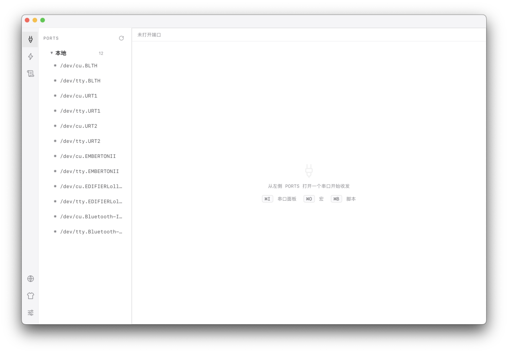

# Serial Studio

[English](README.md) · **简体中文**

<p></p>


**多形态串口通信工具 —— 本地桌面 / Web 浏览器 / 远程。基于 Tauri + Rust + React。**

Serial Studio 让你能从精致的桌面应用、局域网内任意浏览器、或由 LLM 经 MCP 驱动来收发串口数据
——后端都是同一套 Rust 核心。多个客户端可共享同一端口，重复交互能写成宏，端口还能标注设备别名。

<p align="center"></p>

---

## ✨ 功能特性

- **多端口终端** —— 多端口并发，标签页切换，基于 xterm.js。
- **端口共享** —— 多窗口 / 多客户端可 attach 到同一端口。首开者配置生效，后来者加入收发。
  强制关闭可踢掉所有持有者。
- **宏** —— 步骤序列（`send` / `delay` / `expect` / `clear`），可导入 / 导出 JSON，
  跨机器分享。
- **串口别名** —— 给端口标注所连设备，如 `GPS (COM7)`。
- **三种使用形态：**
  - **本地** 桌面应用（IPC 直连，绕过网络）。
  - **Web** —— 浏览器开 `http://host:port/`，界面内嵌在二进制里。
  - **远程** —— 从桌面应用开一个远程窗口连到另一台机器的 Serial Studio。
- **MCP** —— 把串口暴露给 LLM（`serial_list` / `send` / `read` / `grep` / `status` /
  `clear`），可用端口名 **或别名** 寻址。
- **Telnet** —— 兼容老式终端客户端。
- **仪器风 UI** —— 暗 / 亮主题、终端内搜索（Ctrl+F）、字体缩放、RX/TX 流量指示灯。

## 🧱 架构

控制面和数据面刻意分离：

- **控制面**（Tauri IPC）—— 配置、服务生命周期、别名与宏的持久化。
- **数据面**（axum）—— WebSocket、MCP、Telnet；都是同一套 `SerialManager` + `EventBus`
  之上的适配器。

### Crate 划分

| Crate | 职责 |
|---|---|
| `ss-core` | 串口管理器：端口占有权（acquire / release / force-close）、接收缓冲、宏执行器。纯运行时——不碰持久化、不碰 UI。 |
| `ss-server` | axum WS / MCP / Telnet + 内嵌 SPA（`rust-embed`）。Tauri 外壳和独立二进制共用。 |
| `serial-studio`（`tauri-app`） | Tauri 外壳——服务监督 + 控制面命令。 |

## 🛠 技术栈

Tauri 2 · Rust（edition 2021，axum、serialport、tokio）· React 18 · TypeScript · Vite · xterm.js

## 📋 环境要求

- Rust（stable）
- Node.js（构建前端）
- Windows：WebView2（Win 10/11 已预装）
- 一个串口（真实或虚拟）

## 🚀 快速开始

```bash
# 构建前端 + release 二进制
npm install --prefix ui
cargo tauri build

# 或开发模式（前端热重载）
cargo tauri dev
```

release 产物为 `serial-studio.exe`。

## 📖 用法

- **桌面** —— 运行 `serial-studio.exe`。
- **Web / 浏览器** —— 应用启动一个服务（WS `18700`、Telnet `18701`）。局域网内任意机器
  开 `http://<host>:18700/`，界面由二进制直接提供。
- **远程窗口** —— 从桌面应用里开一个远程窗口，连接另一台 Serial Studio 主机。
- **Headless** —— `serial-studio.exe --no-gui` 只跑后台服务（无窗口）。

> **首次运行（未签名构建）：** release 暂未做代码签名。
> - **macOS** —— 会被 Gatekeeper 拦截。拖进 `/Applications` 后去掉隔离标记：
>   ```bash
>   xattr -dr com.apple.quarantine "/Applications/Serial Studio.app"
>   ```
> - **Windows** —— SmartScreen 提示，点「更多信息 → 仍要运行」。

## ⚙️ 配置

运行时配置放在二进制同目录：

| 文件 | 内容 |
|---|---|
| `settings.json` | 服务监听地址 / WS 端口 / Telnet 端口 |
| `ports.json` | 端口元数据（别名等） |
| `macros.json` | 宏 |

## 🤖 MCP

`POST /mcp`，JSON-RPC 协议。六个工具：`serial_list`、`serial_send`、`serial_read`、
`serial_status`、`serial_grep`、`serial_clear`。`port` 参数可用真实端口名 **或别名**。

```jsonc
{
  "jsonrpc": "2.0", "id": 1, "method": "tools/call",
  "params": { "name": "serial_send", "arguments": { "port": "GPS", "data": "AT", "timeout_ms": 1000 } }
}
```

## 🔒 安全提示

服务默认监听 `0.0.0.0` 且**无鉴权**。任何能访问到端口的人都能打开 / 发送数据到你的串口，
并读取其输出。超出可信局域网的范围时，请在 `settings.json` 改绑 `127.0.0.1`，或置于
防火墙 / VPN 之后。

## 📁 项目结构

```
serial-studio/
├─ crates/
│  ├─ core/        # ss-core: 串口管理器 + 端口占有权 + 宏
│  ├─ server/      # ss-server: axum WS/MCP/Telnet + 内嵌 SPA
│  └─ tauri-app/   # serial-studio: Tauri 外壳（控制面）
├─ ui/             # React + TS + Vite 前端
└─ Cargo.toml      # workspace
```

## 🤝 参与贡献

欢迎提 Issue 和 PR。项目较小——改动请控制范围，并尽量贴合现有代码风格。

## 📄 许可证

MIT —— 见 [LICENSE](LICENSE)。
